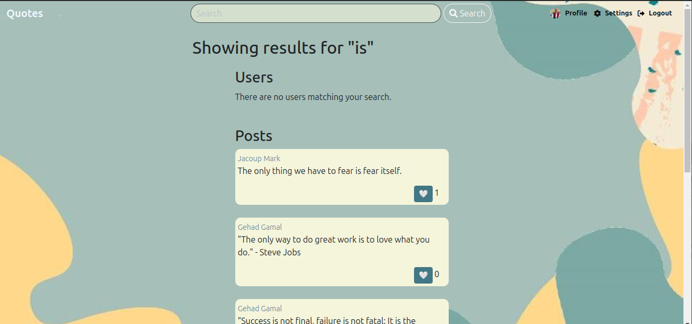
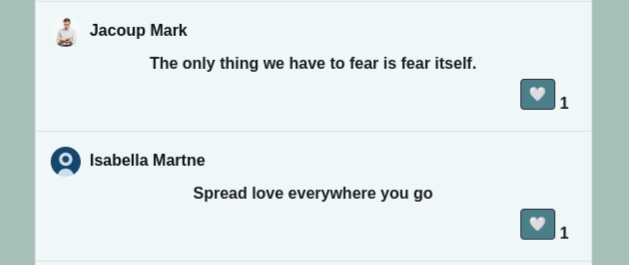

# Quotes Website

Welcome to Quotes - Inspiring Words for All! This website is designed to be a platform where users can explore and share their favorite quotes with a global community. Whether you're looking for motivation, wisdom, or just a bit of inspiration, Quotes has you covered.

## Technologies Used

- **Python** 

- **Flask** 

- **MySQL** 

- **SQLAlchemy** 

- **HTML** 

- **CSS** 

- **JavaScript** 

- **Bootstrap** 

## Key Features

### Create Account
Sign up easily and start your journey to explore and share inspiring quotes with a global community.

### Post a Quo
Share your favorite quotes or original thoughts with the community, and inspire others with your words.

### Search Bar
Search with the name of your favorite writer, user, or specific word to discover quotes that resonate with you.

### Like a Quo
Engage with the community by liking quotes that resonate with you, and discover what others are appreciating.

### Change Profile Picture
Personalize your profile by updating your profile picture, and let the community see who you are.

## User Workflow:
* User Accesses the Website: The user enters the URL of the Quotes website into their web browser.

* Request Sent to the Server: The web browser sends a request to the server hosting the Quotes website.

* Server Processes the Request: The server running the Flask application receives and processes the request.

* Flask Routes the Request: Flask directs the request to the appropriate view function based on the URL.

* View Function Executes: The view function retrieves data from the database, renders HTML templates, and returns the response.

* HTML Sent to the Browser: The server sends the HTML content back to the user's web browser.

* Browser Renders the Page: The web browser receives and renders the HTML content, including CSS styles and JavaScript code.

* User Interacts with the Website: Users can navigate pages, create accounts, post quotes, search, and like quotes.

* Backend Processes User Actions: The server handles user actions by processing requests, updating the database, and sending relevant responses.

* Continuous Interaction: Users can seamlessly interact with the Quotes website, with each action processed by the server to provide a smooth experience.

## About Us

Quotes was founded by Ali Gomaa and Gehad Gamal, driven by a shared passion for art and writing. Recognizing the power of words to inspire and uplift, they envisioned a platform dedicated to sharing favorite quotes with fellow enthusiasts. This project is a Portfolio Project for Holberton School, showcasing our commitment to creating an enriching and inspirational online experience.

### Contact

#### Ali Gomaa
- [LinkedIn](https://www.linkedin.com/in/aligomaa15/)
- [GitHub](https://github.com/aligomaa56)
- [Twitter](https://x.com/aliigomaa_)

#### Gehad Gamal
- [LinkedIn](https://www.linkedin.com/in/gehad-gamal-software-engineer/)
- [GitHub](https://github.com/Gehadazzam)
- [Twitter](https://x.com/Gehad1984)

## How to Run
1. Clone this repository.
2. Install the necessary dependencies using `pip install -r requirements.txt`.
3. Set up your MySQL database using "setup_mysql_server.sql" file.
4. Configure the database connection in the Flask application.
5. Run the Flask application using `python app.py`.
6. Access the website in your browser.

Feel free to explore the codebase and contribute to its development!

&copy; 2024 Quotes. All rights reserved.

